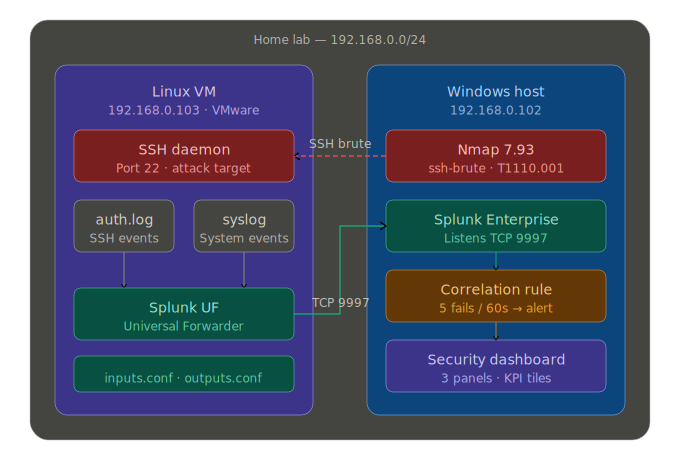
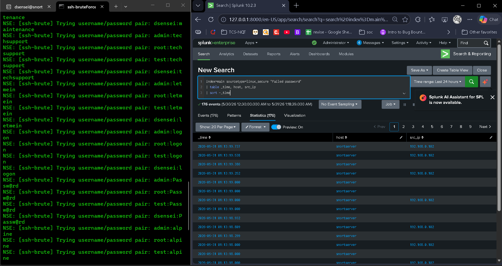
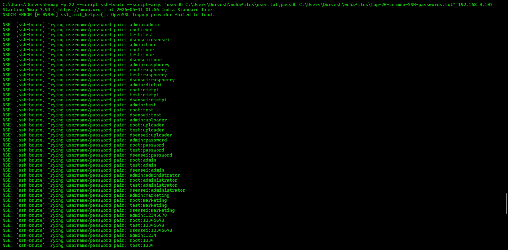
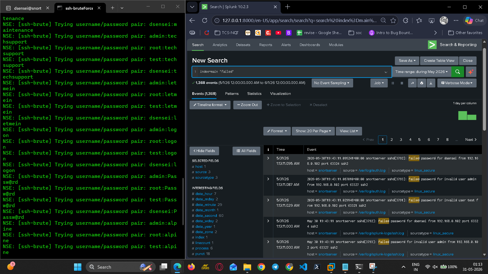
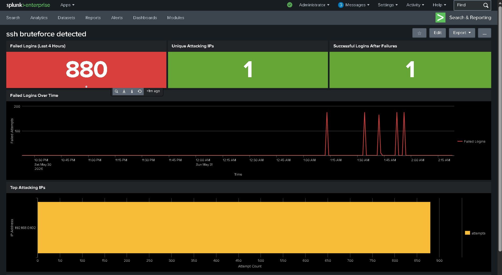
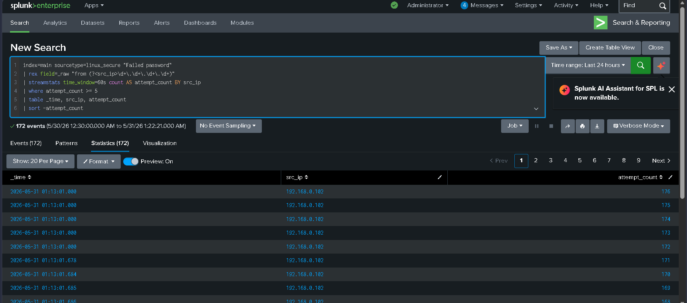
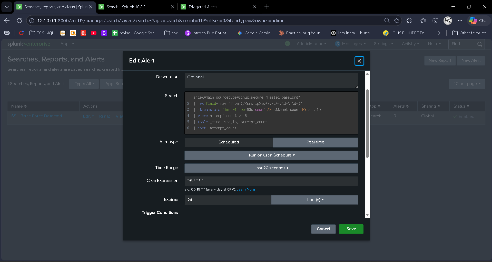
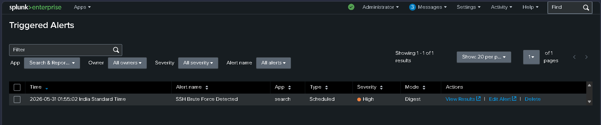
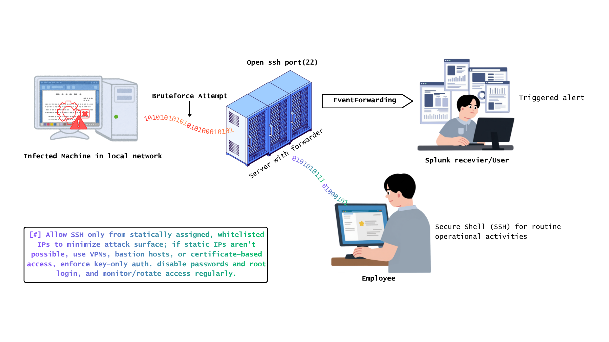

# 🛡️ Splunk SIEM Home Lab: SSH Brute Force Detection

> A local SIEM pipeline that monitors a Linux VM, simulates a real SSH brute-force attack, detects it with a correlation rule, and visualizes the results on a security dashboard.

---

## 📌 Project Summary

|**Objective** | **Details** |
|---|---|
| **Attack simulated** | SSH Brute Force (MITRE ATT&CK T1110.001) |
| **Detection tool** | Splunk Enterprise 9.x |
| **Log sources** | `/var/log/auth.log`, `/var/log/syslog` |
| **Attack tool** | Nmap 7.93 (ssh-brute NSE script) |
| **Environment** | VMware · Windows 11 host · Linux VM |
| **Alert logic** | 5+ failed logins from same IP in 60 seconds |

---

## 🏗️ Architecture


**Data flow:** `auth.log / syslog` → Splunk UF → TCP 9997 → Splunk Enterprise → Correlation Rule → Alert + Dashboard

---

## 📁 Repository Structure

```
splunk-soc-homelab/
├── README.md
├── configs/
│   ├── inputs.conf          # Forwarder —> which files to monitor
│   └── outputs.conf         # Forwarder —> where to send logs
├── detections/
│   └── Brute_Force_Success_Correlation.spl
│   ├── Failed_Login_Over_Time.spl
│   └── Top_Attacking_IPs.spl 
├── dashboards/
│   └── dashboard.png
│   └── splunk.oxps  # Splunk dashboard (importable)
├── MightHelp/
│   └── LearnFromMistake.md  # Solution of problem I faced
│   ├── password.txt  # brute password database I used
│   └── user.txt  # brute userid database I used
└── Resoures/
    ├── Brute_Force_Success_Correlation.png
    ├── alertCreated.png
    └── . . . 
    
```

---

## 🔧 What Was Built

### 1. Log Pipeline

Installed Splunk Universal Forwarder on the Linux VM and configured it to monitor two log sources:

```ini
# inputs.conf
[monitor:///var/log/auth.log]
index = main
sourcetype = linux_secure

[monitor:///var/log/syslog]
index = main
sourcetype = syslog
```

Opened TCP 9997 on the Windows firewall as a custom inbound rule, then verified real-time delivery in Splunk:

```spl
index=main sourcetype=linux_secure | head 20
```

---

### 2. Attack Simulation — MITRE ATT&CK T1110.001

Simulated a password-guessing attack from the Windows host targeting the VM's SSH service using Nmap's `ssh-brute` NSE script.

```bash
nmap -p 22 --script ssh-brute \
  --script-args "userdb=C:\path\user.txt,passdb=C:\path\passwords.txt" \
  192.168.0.103
```

- Wordlist: top 20 common SSH passwords + actual password appended at end
- Single username locked via `userdb` file
- Generated a realistic burst of failed logins in `auth.log`

---

### 3. Detection Rule — Correlation Alert

Written in SPL using a `streamstats` sliding window. Fires when 5+ failed logins arrive from the same IP within 60 seconds.

```spl
index=main sourcetype=linux_secure "Failed password"
| rex field=_raw "from (?<src_ip>\d+\.\d+\.\d+\.\d+)"
| streamstats time_window=60s count AS attempt_count BY src_ip
| where attempt_count >= 5
| table _time, src_ip, attempt_count
```

**Alert config:**
- Schedule: `*/5 * * * *` (every 5 minutes)
- Time range: last 5 minutes
- Trigger: number of results > 0
- Action: Add to Triggered Alerts

---

### 4. Security Dashboard — 3 Panels

| Panel | Type | Query logic |
|---|---|---|
| Failed logins over time | Line chart | `timechart span=1m count` |
| Top attacking IPs | Bar chart | `stats count BY src_ip` |
| Brute force success correlation | Table | Fails + success from same IP = HIGH risk |

Plus 3 KPI tiles (turn red when thresholds exceeded):
- Total failed logins
- Unique attacking IPs
- Compromised accounts detected

---

## 📸 Screenshots

**1. Real-time events arriving in Splunk**


**2. Nmap brute force attack running**




**3. Security dashboard — all 3 panels**


**4. Alert triggered in Splunk**


 ├── **Once Again Attack to check if Alert is triggered or not**


**4. Core Idea - Architecture**

---

## 🛠️ Tools Used

| Tool | Purpose |
|---|---|
| Splunk Enterprise 9.x | SIEM — log indexing, search, alerting |
| Splunk Universal Forwarder | Log shipping from VM to host |
| Nmap 7.93 (ssh-brute NSE) | Attack simulation |
| VMware Workstation | VM environment |
| Linux (Ubuntu/Debian) | Target machine |
| Windows 11 | Host / attacker machine |

---

## 🎯 Key Skills Demonstrated

- SIEM deployment and configuration
- Log forwarding and pipeline setup
- Threat simulation (T1110.001 — SSH Brute Force)
- SPL query writing and correlation logic
- Sliding-window detection engineering
- Security dashboard design
- Alert engineering and scheduling

---

## 📚 References

- [MITRE ATT&CK T1110.001](https://attack.mitre.org/techniques/T1110/001/)
- [Splunk SPL Documentation](https://docs.splunk.com/Documentation/Splunk/latest/SearchReference)
- [Nmap ssh-brute NSE Script](https://nmap.org/nsedoc/scripts/ssh-brute.html)
